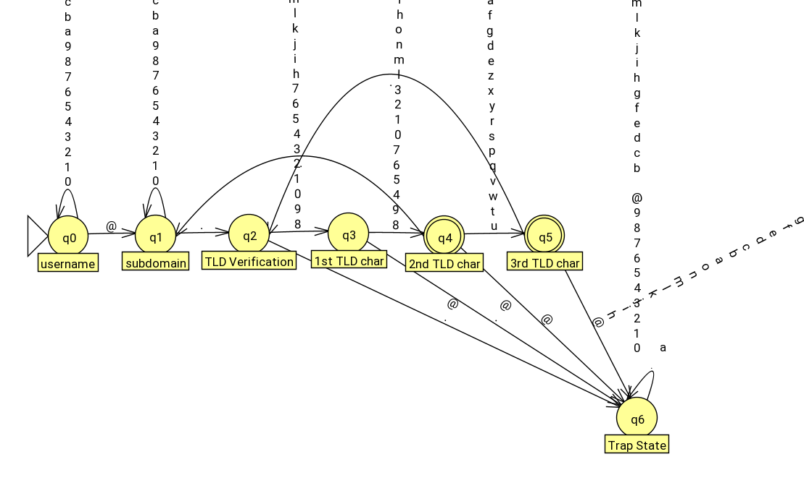
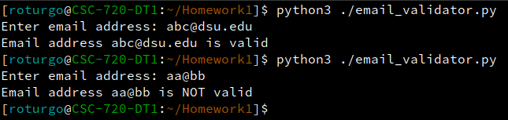

# CSC720-Finite-Automata
Implementing the following JFLAP finite automaton in Python 3 to recognize a valid email address:



# Background: HW1 Problem 9, part 3
This Python 3 program is for DSU CSC 720, Homework Assignment 1, Problem 9 part 3

# Prerequisites
This program is written in Python 3, and has been tested to run on Linux (OpenSUSE Tumbleweed) with Python 3.11.  It should work on any currently-supported Python 3.x interpreter.  No additional libraries are required.

# Running the program
On Linux, you can run this program via the following command on a terminal session:

``` bash
python3 ./email_validator.py
```

1) The program will prompt you to enter an email address on the command line (e.g., abc@dsu.edu).  
2) Once you enter an address, press "ENTER" or "RETURN". 
3) The program will then check whether or not the entered email address is valid.
4) If the email address is determined to be valid, the program will print "Email address *entered text* is valid"
5) If the email address is determined not to be valid, the program will print "Email address *entered text* is NOT valid"

That's it!  Once the results are printed, the program exits.

# Example output
